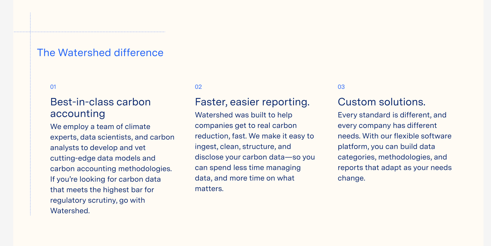
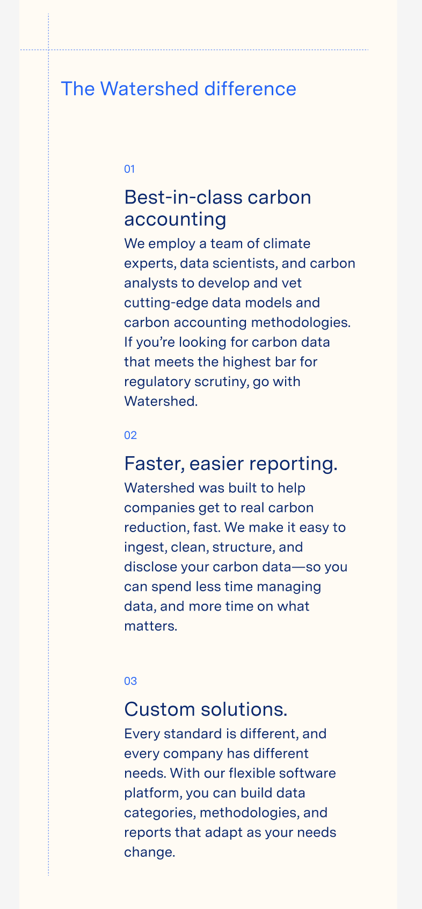
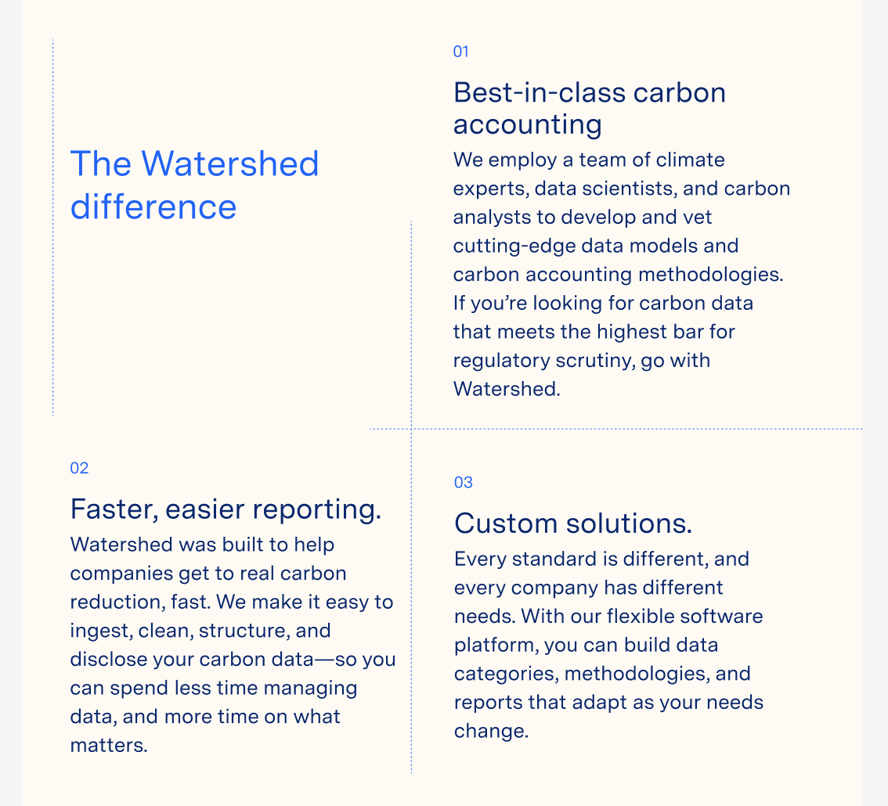

# Web Dev Tech Screen

Hello! Today we'll be making a web component to display informational text, at a variety of breakpoints.

Feel free to use any CSS approach that you'd like.



breakpoint: `520px`



| Attr | Value |
| --- | ----- |
| header (bright blue)      | `#265CFF` |
| body (navy blue)     | `#0B2471` |
| border color     | `#658DFD` |
| background     | `#FFFBF3` |
| header font size     | `28px` |
| body font size     | `20px` |
| index number font size     | `16px` |


```
Best-in-class carbon accounting

We employ a team of climate experts, data scientists, and carbon analysts to develop and vet cutting-edge data models and carbon accounting methodologies. If you’re looking for carbon data that meets the highest bar for regulatory scrutiny, go with Watershed.

Faster, easier reporting

Watershed was built to help companies get to real carbon reduction, fast. We make it easy to ingest, clean, structure, and disclose your carbon data—so you can spend less time managing data, and more time on what matters.

Custom solutions

Every standard is different, and every company has different needs. With our flexible software platform, you can build data categories, methodologies, and reports that adapt as your needs change.
```

## Extra Credit

If there's time, let's go for the gold with a tablet layout:

breakpoint: `820px`

